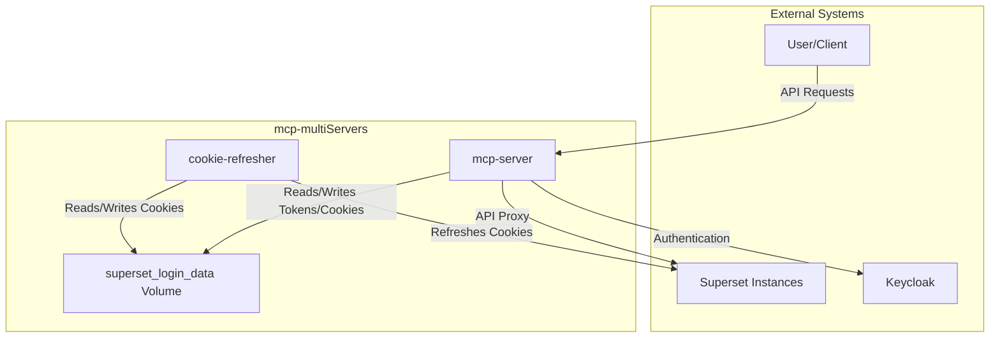

# Multi-Superset MCP Docker Server

Tento projekt poskytuje robustní, kontejnerizovaný FastAPI server, který slouží jako MCP (Model Control Protocol) brána pro více instancí Apache Superset současně. Umožňuje AI modelům a dalším automatizovaným systémům bezpečně a efektivně interagovat s vašimi daty a vizualizacemi napříč různými Superset prostředími (např. produkční, vývojové, testovací).

Server dynamicky spravuje spojení a autentizaci pro každou nakonfigurovanou instanci, stará se o správu a perzistenci autentizačních tokenů a poskytuje přehledné, cílené endpointy pro všechny klíčové operace.

## Klíčové vlastnosti

- **Podpora více Superset instancí**: Spravujte libovolný počet Superset serverů z jediného místa.
- **Plná podpora Superset API**: Implementuje širokou škálu nástrojů pro správu dashboardů, grafů, databází, datasetů a další.
- **Perzistentní přihlášení**: Autentizační tokeny jsou pro každou instanci ukládány na disk, čímž přežijí restart serveru.
- **Docker-first design**: Navrženo pro snadné nasazení a škálování pomocí Docker a Docker Compose.
- **Zabezpečená konfigurace**: Správa přihlašovacích údajů přes strukturovaný JSON soubor.
- **Kompletní testovací sada**: Obsahuje sadu `pytest` testů pro ověření funkčnosti všech endpointů a logiky pro více serverů.

## Instrukce pro spuštění

1.  **Konfigurace serverů**: Zkopírujte soubor `servers.json.example` do nového souboru s názvem `servers.json`.

    ```bash
    cp servers.json.example servers.json
    ```

    Otevřete `servers.json` a definujte všechny Superset instance, které chcete spravovat. Každá instance musí mít unikátní identifikátor (`server_id`), který bude použit v API voláních.

    **Příklad `servers.json`:**
    ```json
    {
      "superset_prod": {
        "base_url": "http://192.168.37.200:8088",
        "username": "admin_prod",
        "password": "password_prod"
      },
      "superset_dev": {
        "base_url": "http://localhost:8089",
        "username": "admin_dev",
        "password": "password_dev"
      }
    }
    ```
    Ujistěte se, že `base_url` je adresa dostupná z Docker kontejneru.

    **Konfigurace pro Keycloak (OAuth) a více instancí**

    Pro připojení k Superset instanci, která využívá Keycloak pro autentizaci, nastavte `auth_method` na `"keycloak"`. Pro maximální flexibilitu a bezpečnost je doporučeno veškerou konfiguraci specifickou pro dané prostředí (včetně `base_url` a `token_url`) spravovat pomocí proměnných prostředí.

    Toho dosáhnete definováním unikátních názvů pro proměnné prostředí v `servers.json` pro každý server.

    **Příklad `servers.json` s více Keycloak instancemi:**
    ```json
    {
      "superset_3": {
        "auth_method": "keycloak",
        "provider": "oidc",
        "base_url_env": "BASE_URL_3",
        "token_url_env": "TOKEN_URL_3",
        "keycloak_username_env": "KEYCLOAK_USERNAME_3",
        "keycloak_password_env": "KEYCLOAK_PASSWORD_3",
        "client_id_env": "CLIENT_ID_3",
        "client_secret_env": "CLIENT_SECRET_3"
      },
      "superset_4": {
        "auth_method": "keycloak",
        "provider": "oidc",
        "base_url_env": "BASE_URL_4",
        "token_url_env": "TOKEN_URL_4",
        "keycloak_username_env": "KEYCLOAK_USERNAME_4",
        "keycloak_password_env": "KEYCLOAK_PASSWORD_4",
        "client_id_env": "CLIENT_ID_4",
        "client_secret_env": "CLIENT_SECRET_4"
      }
    }
    ```
    - `auth_method`: Musí být `"keycloak"`.
    - `provider`: Typ poskytovatele, který očekává Superset (často `"oidc"`).
    - `base_url_env`: Název proměnné prostředí obsahující URL adresu Superset instance.
    - `token_url_env`: Název proměnné prostředí obsahující URL adresu Keycloak serveru pro získání tokenu.
    - `..._env`: **Unikátní názvy** ostatních proměnných prostředí pro každý server. Doporučuje se používat přípony (např. `_3`, `_4`) pro přehlednost.

    Následně vytvořte soubor `.env` (nebo ho zkopírujte z `.env.example`) a vyplňte do něj odpovídající hodnoty pro každý server:
    ```env
    # Konfigurace pro server 'superset_3'
    BASE_URL_3=http://192.168.37.201:8088
    TOKEN_URL_3=https://id.portabo.org/realms/portabo.cz/protocol/openid-connect/token
    KEYCLOAK_USERNAME_3=uzivatel_pro_3
    KEYCLOAK_PASSWORD_3=heslo_pro_3
    CLIENT_ID_3=client_id_pro_3
    CLIENT_SECRET_3=client_secret_pro_3

    # Konfigurace pro server 'superset_4'
    BASE_URL_4=http://192.168.37.202:8088
    TOKEN_URL_4=https://id.another-provider.com/realms/another-realm/protocol/openid-connect/token
    KEYCLOAK_USERNAME_4=uzivatel_pro_4
    KEYCLOAK_PASSWORD_4=heslo_pro_4
    CLIENT_ID_4=client_id_pro_4
    CLIENT_SECRET_4=client_secret_pro_4
    ```
    Tento přístup zajišťuje, že každý server používá správné přihlašovací údaje a nedochází ke konfliktům.

2.  **Sestavení a spuštění kontejneru**:

    Pro spuštění na pozadí použijte:
    ```bash
    docker compose up --build -d
    ```
    **Poznámka k perzistenci cookies:**
    Pro sdílení autentizačních cookies mezi službami `mcp-server` a `cookie-refresher` je nyní využíván Docker volume s názvem `superset_login_data`. Tento volume zajišťuje perzistentní úložiště pro soubory jako `cookies.txt` a `access_token.txt` v rámci kontejnerů, aniž by byl přímo vázán na hostitelský souborový systém. To umožňuje, aby si služby udržely stav přihlášení i po restartu kontejnerů a zároveň poskytuje izolovaný sdílený prostor.


3.  **Ověření**:
    - Server by měl být dostupný na adrese `http://localhost:8903` (dle nastavení v `docker-compose.yml`).
    - Můžete ověřit stav zavoláním `curl http://localhost:8903/`.
    - Kompletní OpenAPI specifikace je dostupná na `http://localhost:8903/openapi.json`.

4.  **Spuštění testů (volitelné)**:

    Pro ověření správné funkčnosti všech nástrojů můžete spustit integrované testy:
    ```bash
    docker compose -f mcp/docker-compose.yml run --rm app pytest tests/test_api.py
    ```

**Poznámka k síťování:** Pokud se server nemůže připojit k Supersetu (chyby `Connection timed out`), ujistěte se, že firewall na stroji se Supersetem povoluje příchozí spojení na daném portu z Docker sítě.

## Seznam implementovaných nástrojů

Následuje kompletní seznam dostupných API endpointů. Všechny endpointy nyní vyžadují `{server_id}` jako první část cesty, která specifikuje, na kterou Superset instanci se má požadavek poslat.

**Příklad:** Pro získání seznamu dashboardů z produkční instance (`superset_prod`) zavolejte `GET /superset_prod/dashboards`.

### Autentizace (`/{server_id}/auth/...`)
- `POST /auth/login`: Provede přihlášení pro daný server a uloží token na disk.
- `POST /auth/logout`: Provede odhlášení a smaže uložený token.
- `GET /auth/check`: Ověří platnost aktuálního tokenu pro daný server.
- `POST /auth/refresh`: Obnoví platnost tokenu a aktualizuje ho na disku.

### Dashboardy (`/{server_id}/dashboards/...`)
- `GET /dashboards`: Získá seznam všech dashboardů.
- `GET /dashboards/{id}`: Získá detaily konkrétního dashboardu.
- `POST /dashboards`: Vytvoří nový dashboard.
- `PUT /dashboards/{id}`: Aktualizuje existující dashboard.
- `DELETE /dashboards/{id}`: Smaže dashboard.

### Grafy (Charts) (`/{server_id}/charts/...`)
- `GET /charts`: Získá seznam všech grafů.
- `GET /charts/{id}`: Získá detaily konkrétního grafu.
- `POST /charts`: Vytvoří nový graf.
- `PUT /charts/{id}`: Aktualizuje existující graf.
- `DELETE /charts/{id}`: Smaže graf.

### Databáze (`/{server_id}/databases/...`)
- `GET /databases`: Získá seznam databází.
- `GET /databases/{id}`: Získá detaily databáze.
- `POST /databases`: Vytvoří nové připojení k databázi.
- `GET /databases/{id}/tables`: Získá seznam tabulek v databázi.
- `GET /databases/{id}/schemas`: Získá seznam schémat v databázi.
- `POST /databases/test_connection`: Otestuje připojení k databázi.
- `PUT /databases/{id}`: Aktualizuje připojení k databázi.
- `DELETE /databases/{id}`: Smaže připojení k databázi.
- `POST /databases/{id}/validate_sql`: Zvaliduje SQL dotaz.

### Datasety (`/{server_id}/datasets/...`)
- `GET /datasets`: Získá seznam všech datasetů.
- `GET /datasets/{id}`: Získá detaily konkrétního datasetu.
- `POST /datasets`: Vytvoří nový dataset.

### SQL Lab (`/{server_id}/sqllab/...`)
- `POST /sqllab/execute`: Spustí SQL dotaz.
- `GET /sqllab/saved_queries`: Získá seznam uložených dotazů.
- `POST /sqllab/format_sql`: Zformátuje SQL dotaz.
- `GET /sqllab/results/{key}`: Získá výsledky dříve spuštěného dotazu.

### Ostatní (`/{server_id}/...`)
- `GET /activity/recent`: Získá nedávnou aktivitu uživatele.
- `GET /user/current`: Získá informace o aktuálním uživateli.
- `GET /user/roles`: Získá role aktuálního uživatele.
- `GET /tags`: Získá seznam všech tagů.
- `GET /config/base_url`: Získá nakonfigurovanou základní URL pro daný server.
- `GET /config/server_info`: Získá informace (ID a URL) o všech nakonfigurovaných Superset serverech.

## Konfigurace klienta

Pro připojení k tomuto MCP serveru z klientské aplikace (např. Gemini v Android Studiu, Kilo, AI Coding) je potřeba upravit konfigurační soubor klienta (obvykle `settings.json` nebo podobný).

Přidejte novou položku do sekce `mcpServers`:

```json
{
    "mcpServers": {
        "mcpsup": {
            "url": "http://URL_HOST:8903/mcp"
        }
    }
}
```

- Nahraďte `URL_HOST` veřejnou IP adresou nebo DNS jménem stroje, na kterém běží tento Docker kontejner.
- Ujistěte se, že port `8903` je na tomto stroji dostupný a správně namapovaný.
- Název `mcpsup` je pouze příklad, můžete si zvolit libovolný název pro identifikaci serveru.

## Příklady použití s AI modelem

Jakmile je MCP server správně nakonfigurován a Gemini (nebo jiný AI model) má přístup k jeho nástrojům, můžete s ním interagovat pomocí přirozeného jazyka. Klíčové je specifikovat `server_id` (např. `superset_prod`, `superset_dev`, `superset_1`, `superset_2`) v dotazu, aby AI model věděl, na kterou instanci Supersetu se má požadavek vztahovat.

Zde jsou některé příklady dotazů, které můžete použít:

### Získání informací o serverech
- "Kolik Superset serverů je nakonfigurováno?"
- "Jaké jsou ID a URL nakonfigurovaných Superset serverů?"

### Autentizace
- "Přihlas mě k Superset serveru `superset_1`."
- "Odhlásit se ze serveru `superset_2`."
- "Zkontroluj platnost tokenu pro `superset_prod`."

### Práce s dashboardy
- "Vypiš všechny dashboardy na serveru `superset_1`."
- "Ukaž mi detaily dashboardu s ID 123 na `superset_prod`."
- "Vytvoř nový dashboard s názvem 'Můj nový dashboard' na `superset_dev`."

### Práce s grafy
- "Seznam všech grafů na `superset_2`."
- "Vytvoř nový sloupcový graf s názvem 'Prodeje za měsíc' na `superset_prod` s datovým zdrojem ID 5 a vizualizací 'bar'."

### Práce s databázemi a datasety
- "Vypiš všechny databáze na `superset_1`."
- "Získej tabulky z databáze s ID 4 na `superset_dev`."
- "Vytvoř nový dataset 'moje_data' z tabulky 'sales_data' v databázi s ID 7 na `superset_prod`."

### SQL Lab
- "Spusť SQL dotaz 'SELECT * FROM users LIMIT 10' na databázi s ID 1 na `superset_1`."
- "Zformátuj tento SQL dotaz: SELECT * FROM my_table WHERE id = 1;"

Tyto příklady demonstrují, jak můžete pomocí přirozeného jazyka a specifikace `server_id` efektivně spravovat více Superset instancí.

## Komunikační matice

Následující diagram a tabulka popisují hlavní komunikační toky v rámci systému.

### Diagram


### Tabulka

| From              | To                  | Protocol | Description                                      |
| ----------------- | ------------------- | -------- | ------------------------------------------------ |
| User/Client       | `mcp-server`        | HTTP/S   | API requests to manage Superset instances.       |
| `mcp-server`      | Superset Instances  | HTTP/S   | Proxies API requests to the Superset servers.    |
| `mcp-server`      | Keycloak            | HTTP/S   | Authenticates users via Keycloak (if configured).|
| `mcp-server`      | `superset_login_data` | Volume   | Reads and writes authentication tokens/cookies.  |
| `cookie-refresher`| `superset_login_data` | Volume   | Reads and writes authentication cookies.         |
| `cookie-refresher`| Superset Instances  | HTTP/S   | Refreshes authentication cookies.                |